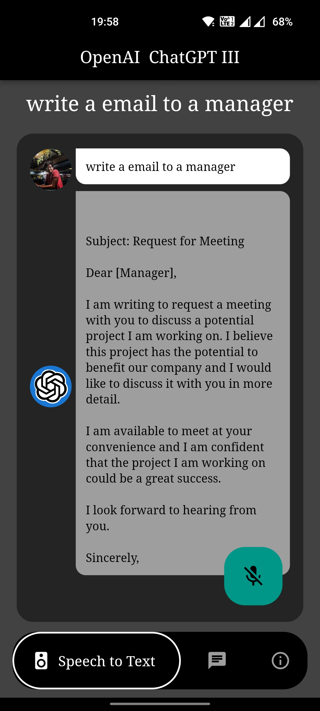
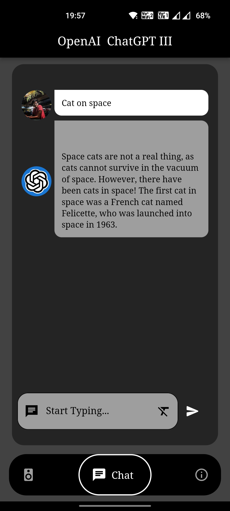
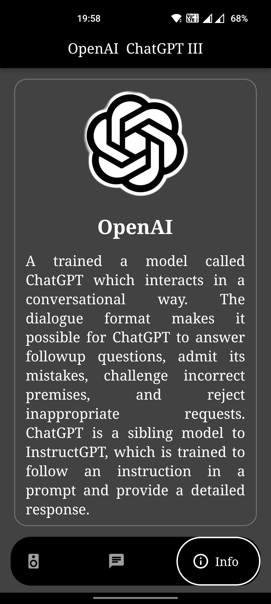

# ChatGPT III - Flutter

ChatGPT incorporated 

## Getting Started

```bash
flutter pub get
```

## Results
<p>

&nbsp; &nbsp; &nbsp;

</p>
&nbsp;
<p>

&nbsp; &nbsp; &nbsp;

</p>


## References
1.google_fonts <br>
2.google_nav_bar <br>
3.avatar_glow <br>
4.flutter_dotenv <br>
5.speech_to_text <br>
6.http <br>
7.flutter_launcher_icons
